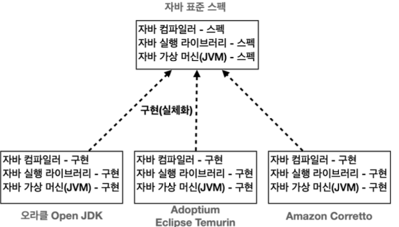
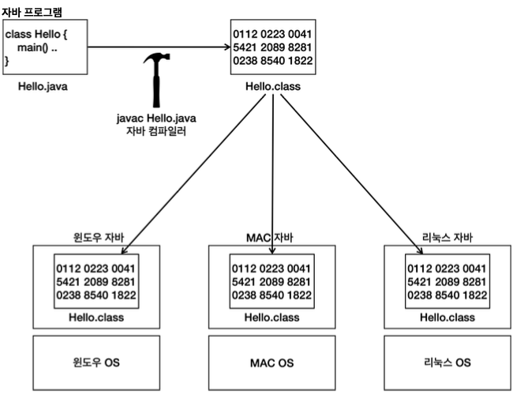
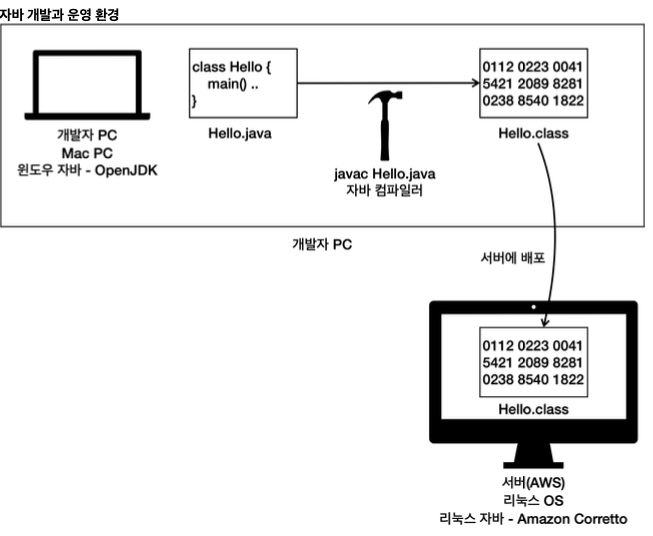

# Java의 표준 스펙

- 표준 스펙과 구현으로 나눌 수 있다
    - Java를 만들기 위한 설계도 및 문서
    - 표준 스펙을 기반으로 여러 회사에서 실제 작동하는 자바를 만든다.
    - Java Community Process (JCP)를 통해서 관리된다
- 다양한 자바 구현
    - 여러 회사에서 자바 표준 스펙에 맞추어 실제 작동하는 자바 프로그램을 개발한다.
    - 각각의 회사에 최적화되어 있는 Java이기 때문에 각각의 장단점이 있다
    - 각 회사들은 대부분 윈도우, MAC, 리눅스 같이 다양한 OS에서 작동하는 버전의 자바도 함께 제공한다.
- 표준 스펙과 구현 방법으로 분리되면 얻게 되는 장점
    - 다른 JDK로 마이그레이션이 필요할 경우 특별한 문제 없이 별다른 코드 변경을 하지 않아도 잘 동작한다
- 컴파일 / 실행
    - Java에서 제공하는 `javac` 를 사용해서 `.java` 파일을 `.class` 파일로 변환 한다
        - 자바 소스 코드를 바이트코드로 변환하며 자바 가상 머신에서 더 빠르게 실행될 수 있게 최적화하고 문법 오류도 검출한다.
    - 자바 프로그램을 실행한다.
        - 자바가 제공하는 `java` 라는 프로그램을 사용한다.
        - 자바 가상 머신(JVM)이 실행되면서 프로그램이 작동한다.
- 운영체제의 독립성
    - 자바 프로그램은 자바가 설치된 모든 OS에서 실행할 수 있다.

    - Java 프로그램은 Java가 설치된 모든 OS에서 실행할 수 있다.
    - Java 개발자는 특정 OS에 맞추어 개발을 하지 않아도 된다. Java 개발자는 Java에 맞추어 개발하면 된다. OS 호환성 문제는 Java가 해결한다. `Hello.class` 와 같이 컴파일된 Java 파일은 모든 Java 환경에서 실행할 수 있다.
    - 윈도우 자바는 윈도우 OS가 사용하는 명령어들로 구성되어 있다. MAC이나 리눅스 자바도 본인의 OS가 사용하는 명령어들로 구성되어 있다. 개발자는 각 OS에 맞도록 Java를 설치하기만 하면 된다.
- Java 개발 환경
    - Java 개발과 운영 환경

      - 개발할 때 Java와 서버에서 실행할 때 다른 Java를 사용할 수 있다.
      - 개발자들과 서버 컴퓨터에 OS 가 다를 경우에도 각 컴퓨터에 Java가 설치가 되어있기만 하더라도 Java 파일이 실행이 가능하다
      - 자바의 운영체제 독립성 덕분에 각각의 환경에 맞추어 자바를 설치하는 것이 가능하다.