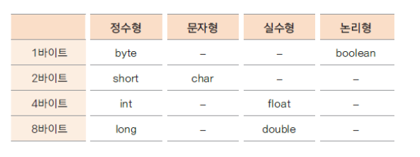

# Java 기초 문법

## [1. 변수](#1-변수)
## [2. 기본 자료형](#2-기본-자료형)
## [3. 상수, 리터럴](#3-상수-리터럴)
## [4. 연산자](#4-연산자)
## [5. 조건문](#5-조건문)
## [6. 반복문]()

## 1 변수
- 프로그램에서는 항상 변하는 값을 나타낼 필요가 있음
  ( ex. 학생의 성적, 합계, 게임의 레벨, 회원 주소 등등...)
- 표현하려는 수에 맞는 데이타 타입(자료형)을 이용하여 변수를 선언
- 표현하려는 자료가 숫자, 문자, 문자열등 다양할 수 있으므로 그에 맞는 자료형을 사용

```java
package my_java;

public class Variable {

	public static void main(String[] args) {
		int age, count;
		age = 10;
		count = 1;
		
		int level = 10000;
		System.out.println(age);
		System.out.println(count);
		System.out.println(level);
	}

}

```

## 2 기본 자료형


- Java에서는 정수형은 기본 4Byte, 실수형은 기본 8Byte로 구성되어 있기 때문에 다른 자료형 사용 시에는 옆에 각 자료형의 앞 문자를 붙인다

```java
package default_data_type;

public class DefaultDataType {
	public static void main(String[] args) {
		byte bnum = -128;
		long lnum = 12345678900L;  //숫자는 4byte로 설정 되어있기 때문에 뒤에 L을 붙여서 long형을 표시해준다
	
	
		System.out.println(bnum);
		System.out.println(lnum);
	}
}
```

### 지역변수 자료형 없이 사용하기(Java10 부터 사용 가능)

- 자료형으로 변수 타입을 지정해주는 것이 아닌 var을 이용해서 자동으로 자료형추론을 해서 사용이 가능하게 한다

```java
package local_variable_type;

public class LocalVariableType {
  public static void main(String[] args) {

    var i = 10;
    var j = 10.0;
    var str = "hello";

    System.out.println(i);
    System.out.println(j);
    System.out.println(str);

    str = "test";
    //str = 3; 
  }
}
```

## 3 상수,리터럴

### 1. 상수
- 상수는 변하지 않는 수
- final 예약어를 사용하여 선언한다
- 상수를 사용하면 변하지 않는 값을 반복하여 사용할 때 의미있는 문자로 인식하기 쉽고
  혹, 변하더라도 선언한 부분만 변경하면 되므로 여러부분을 수정할 필요가 없음

```java
package constant;

public class Constant {

  public static void main(String[] args) {

    final int MAX_NUM = 100;
    final int MIN_NUM;

    MIN_NUM = 0;

    System.out.println(MAX_NUM);
    System.out.println(MIN_NUM);

    //MAX_NUM = 1000;
  }
}

```

### 2. 리터럴(literal)

- 프로그램에서 사용하는 숫자, 문자, 논리값을 뜻함
- 리터럴은 상수 풀(constant pool)에 있음
- 정수 리터럴은 int 로 실수 리터럴은 double 로 저장됨
  정수의 범위가 넘어가는 경우는 L,l을 float로 사용하려는 경우는 F,f 식별자를 써줘야 함

### 3. 형 변환(type conversion)

- 서로 다른 자료형 간에 연산등의 수행을 위해 하나의 자료형으로 통일하는 것
- 묵시적 형 변환(implicit type conversion, 자동 형 변환)과 명시적 형 변환(explicit type conversion, 강제 형 변환)이 있음
- 바이트 크기가 작은 자료형에서 큰 자료형으로 형 변환은 자동으로 이루어 짐
- 덜 정밀한 자료형에서 더 정밀한 자료형으로읜 형 변환은 자동으로 이루어 짐

```java
package type_conversion;

public class TypeConversion {

	public static void main(String[] args) {

		double dNum = 1.2;
		float fNum = 0.9F;
		
		int iNum1 = (int) dNum + (int) fNum; // 두 실수가 정수로 바뀌고 더해진다
		int iNum2 = (int)(dNum + fNum); // 두 실수가 더해진 후 정수로 바뀐다
		
		System.out.println(iNum1);
		System.out.println(iNum2);
	}

}

```

## 4 연산자

1. 산술 연산자
   - +, -, x, /, %(몫을 뺀 나머지만 구할 때 쓰는 연산자)
2. 대입 연산자
   - =
3. 증감 연산자 
   - ++, - -
   - ++a(- -a)는 프로그램이 돌아감과 동시에 변수 값에 +(-)를 해준다(전위표기)
   - a++(a- - )는 최초 값은 그대로 사용하고 다음 사용시 +(-)를 해준다(후위표기)
4. 관계 연산자
   - ==(같다), ! =(같지 않다), > =,  < =, >, <
5. 논리 연산자
   - &&(and, 그리고), ||(or, 또는), !(부정 연산자)
6. 숏 서킷 룰
   - &&, ||에 적용되는 룰, 좌항의 값이 True일 경우 ||에서는 우항을 값을 살피지 않고 true 라는 결과가 나오고 좌항의 결과가 false일 경우 &&에서는 우항의 값을 살피지 않고 false라는 결과가 나온다
7. 복합 대입 연산자
   - +=, -=, x=, /=, %=
   - 좌항의 값과 우항의 값을 연산하여 좌항에 변수에 저장하는 연산자
8. 콤마(,) 연산자 
   - 여러개의 수식을 한번에 나열 할 때 사용한다
9. 조건 연산자
   - 유일한 삼항 연산자 이다
    ```java
    package condition;

    public class ConditionOperator {

	    public static void main(String[] args) {
		    int a=10, b=20, res;
		    res = (a>b) ? a:b; //조건 식이 참이면 a를 선택 거짓이면 b를 선택
		    System.out.println(res);
        }
    }
    ```
10. 비트 연산자
    - &, |, ^, >>, <<, ~
    ```java
    package bit_operator;
    
    public class BitOperator {
    
        public static void main(String[] args) {
            int a =10, b = 12;
            System.out.println(a & b); // 각각 변수의 값을 비트별로 논리곱 연산을 수행한다
            System.out.println(a | b); // 각각 변수의 값을 비트별로 논리합 연산을 수행한다
            System.out.println(a ^ b); // 각각 변수의 값을 비트별로 베타적 논리합 연산을 수행한다(두 비트가 서로 다른 경우에만 1로 계산)
            System.out.println(~a); // 해당 변수의 값의 비트를 반전시키는 연산자
            System.out.println(a << 1); // 해당 변수의 값의 비트를 왼쪽으로 이동하는 연산자
            System.out.println(a >> 2); // 해당 변수의 값의 비트를 오른쪽으로 이동하는 연산자
        }	
    }

    ```
 11. 연산자 우선 순위

    | 종류        | 우선순위 | 연산자                                      | 연산 방향 |
    |-----------|------|------------------------------------------|-------|
    | 1차 연산자    | 1    | `( ) [ ] . - >`                          | ->    |
    | 단항 연산자    | 2    | `- ++ $--$ ~ ! x & sizeof(type)`         | <-    |
    | 산술 연산자    | 3    | `x / %`                                  | ->    |
    | 산술 연산자    | 4    | `+ -`                                    | ->    | 
    | 비트 이동 연산자 | 5    | `<< >>`                                  | ->    | 
    | 관계 연산자    | 6    | `< ≤ > ≥`                                | ->    |
    | 동등 연산자    | 7    | `== ≠`                                   | ->    | 
    | 비트 논리 연산자 | 8    | `&`                                      | ->    |
    | 비트 논리 연산자 | 9    | `^`                                      | ->    |
    | 비트 논리 연산자 | 10   | `\|`                                     | ->    |
    | 논리 연산자    | 11   | `&&`                                     | ->    |
    | 논리 연산자    | 12   | `\|\|`                                   | ->    |
    | 조건 연산자    | 13   | `?:`                                     | ->    |
    | 대입 연산자    | 14   | `= += -= x= /= %= &= ^= \|= $<<=$ $>>=$` | <-    |
    | 콤마 연산자    | 15   | `,`                                      | ->    |

## 5 조건문

- 주어진 조건에 따라 다른 실행이 이루어 지도록 구현
- if문 문법
```java
package if_else;

import java.util.Scanner;

public class IfElse {

	public static void main(String[] args) {

		int age = 7;

		//Scanner scanner = new Scanner(System.in);
		//int age = scanner.nextInt();
		
		if( age >= 8) {
			System.out.println("학교에 다닙니다");
		}
		else {
			System.out.println("학교에 다니지 않습니다.");
		}
	}
}
```
- 조건이 여러개 일 때 if 문
```java
package if_else_if_else;

public class IfElseIfElse {

   public static void main(String[] args) {
   	int age = 12;
   	int charge;
   	
   	if(age < 8){
   		charge = 1000; 
   		System.out.println("미 취학 아동입니다.");
   	}
   	else if(age < 14){
   		charge = 2000;
   		System.out.println("초등학생 입니다.");
   	}
   	else if(age < 20){
   		charge = 2500;
   		System.out.println("중, 고등학생 입니다.");
   	}
   	else{
   		charge = 3000;
   		System.out.println("일반인 입니다.");
   	} 
   	
   	System.out.println("입장료는 " + charge + "원입니다.");
   }
}
```
- Switch ~ Case 문

  - if - else if - else 문을 사용할 때 복잡하고 번거로운 부분을 가독성 좋게 구현
  - 비교 조건이 특정 값이나 문자열인 경우 사용
  - break 문을 사용하여 각 조건이 만족되면 switch 블럭을 빠져나오도록 함
  - 자바 14부터 좀 더 간결해진 표현식이 지원 됨 ( break 사용하지 않음 )
    ```java
        package switch_case;
        
        public class SwitchCase {
    
        public static void main(String[] args) {
    
            int month = 10;
            int day;
            
            switch(month){
            
                case 1: case 3: case 5: case 7: case 8: case 10: case 12:
                    day = 31;
                    break;
                case 4: case 6: case 9: case 11:
                    day = 30;
                    break;
                case 2: 
                    day = 28;
                    break;
                default:
                    day = 0;
                    System.out.println("존재하지 않는 달 입니다.");
                
            }
            System.out.println(month + "월은 " + day + "일입니다.");
        }
    }
      ```
- *Switch Expression*
  - 쉼표(,)로 조건 구분
  - 식으로 표현 하여 반환 값을 받을 수 있음. 리턴 값이 없는 경우는 오류가 생김
  - yield 키워드 사용
    ```java
      package switch_case_up;

      public class SwitchCaseUp {

      public static void main(String[] args) {
		
          int month = 3;
		
          int day = switch (month) {
              case 1, 3, 5, 7, 8, 10,12 -> {
                  System.out.println("한 달은 31일입니다."); 
                  yield 31;
              }
              case 4,6,9,11 -> {
                  System.out.println("한 달은 30일입니다."); 
                  yield 30;
              }
              case 2 ->{
                  System.out.println("한 달은 28일입니다.");
                    yield 28;
              }
              default->{
                    System.out.println("존재하지 않는 달 입니다."); 
                  yield 0;
              }
          };
          System.out.println(month + "월은 " + day + "일입니다.");
        }
      }
    ```
    
## 반복문

- 주어진 조건에 맞는 동안(true) 지정된 수행문을 반복적으로 수행하는 제어문
- 조건이 맞지 않으면 반복하던 수행을 멈추게 됨
- 조건은 주로 반복 횟수나 값의 비교의 결과에 따라 true, false 판단 됨

1. While 문
```java
package while_;

public class While {

	public static void main(String[] args) {

		int num = 1;
		int sum  = 0;
		
		while( num <= 10) {
			
			sum += num;
			num++; // 증감식을 지정을 안 할 경우 무한 루프에 빠지게 된다
		}
		
		System.out.println(sum);
		System.out.println(num);
	}

}
```
2. Do While 문
- while문은 조건을 먼저 체크하고 반복 수행이 된다면, do-while은 조건과 상관 없이 수행을 한 번 하고나서 조건을 체크
- while문과의 차이 점은 최초의 한번이 먼저 실행 된다는 점이다
```java

package do_while;

import java.util.Scanner;

public class Dowhile {

	public static void main(String[] args) {

		Scanner scanner = new Scanner(System.in);
		int input; 
		int sum = 0;

		do {
			input = scanner.nextInt();
			sum += input;
			
		}while(input != 0);

			
		System.out.println(sum);
	}

}
```
3. For
- 특정 수의 범위, 횟수와 관련하여 반복되는 경우 주로 사용한다
```java
package for_loop;

public class ForLoop {

	public static void main(String[] args) {
	
		int count =1;
		int sum = 0;
		
		for( int i = 0 ; i<10; i++, count++) {  //10번
			sum += count;
			//count++;
		}
		System.out.println(sum);
	}
}
```

4. Break
- 감싸고 있는 제어문의 블록을 빠져 나오는 기능 (switch문 에서도 사용)
- 반복문에서는 주로 조건문(if)와 같이 사용하여 조건에 해당되는 경우 반복 수행을 멈추고 반복문 외부로 수행이 이동
- 여러 반복문이 중첩되어 있는 경우엔 break 문이 포함되어 있는 반복문만 빠져 나옴
```java
package loop_break;

public class LoopBreak {

	public static void main(String[] args) {

		int sum = 0;
		int num;
		for( num = 1; ; num++) {
			
			sum += num;
			if( sum >= 100)	break;
		}
		
		System.out.println(sum);
		System.out.println(num);
	}
}
```
5. Continue
- 반복문 내부에서 조건문(if)와 같이 사용하며, 조건이 맞는 경우(true 이면) 이후 반복문 블럭 내부의 다른 수행문들을 수행하지 않음
```java
package loop_continue;

public class LoopContinue {

	public static void main(String[] args) {
		int num;
		for( num = 1; num <= 100; num++) {
			
			if( (num % 3) != 0) continue; 
			
			System.out.println(num);
			
		}
	}
}
```